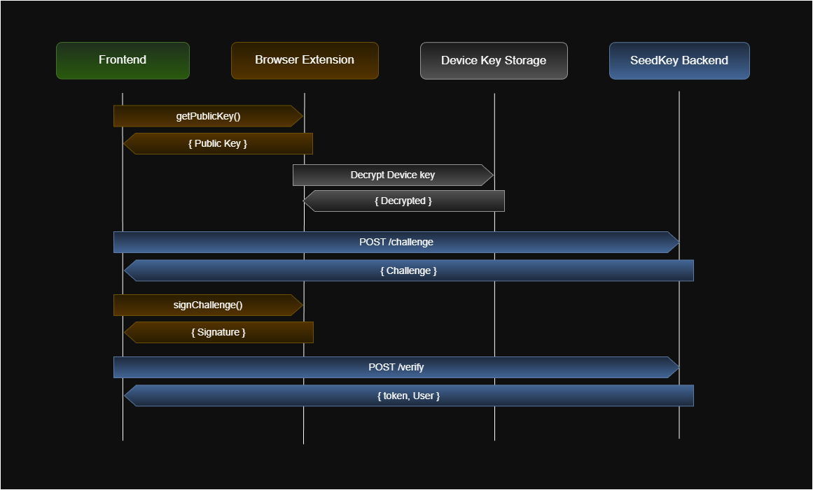

# 🔐 SeedKey Extension

[](https://addons.mozilla.org/ru/firefox/addon/seedkey/)


SeedKey Extension is a multi-browser extension for **passwordless authentication**, and part of the SeedKey Open Source ecosystem.  
It enables websites to work efficiently with keys and signatures, while giving users independence from cloud platforms.  
Based on a seed phrase, the extension generates a master key used to derive keys for a specific domain.

User flow:
- create a new seed phrase
- restore an identity from a seed phrase

Website flow:
- get a public key
- sign a challenge

## Table of Contents
- [🧩 Features](#-features)
- [🔍 Interaction Architecture. How it works](#-interaction-architecture-how-it-works)
- [🔒 Security & Privacy](#-security--privacy)
- [🗺️ Roadmap](#️-roadmap)
- [🤝 Contributing](#-contributing)
- [🛡️ Vulnerability Disclosure](#-vulnerability-disclosure)
- [🧑‍💻 Development](#-development)
- [🚩 Usage](#-usage)
- [🔌 Website Integration](#-website-integration)
- [🕵️ Privacy](#privacy)
- [📄 License](#license)

## 🧩 Features
- **Identity creation**: generate a 12-word seed phrase.
- **Recovery**: restore an identity from a seed phrase.
- **Per-domain keys**: derive a separate Ed25519 keypair for each domain.
- **Challenge signing**: securely sign a challenge from the service.
- **Arbitrary message signing**: for custom scenarios.
- **i18n**: EN/RU multilingual support.

## 🔍 Interaction Architecture. How it works
### Current MVP architecture:


- **Seed phrase → master key**: when creating an identity, the master key is derived from the seed phrase and stored in `browser.storage.local`.
- **Master key → site keys**: for each website/domain, a separate Ed25519 keypair is derived.
- **Website communication**: the website talks to the extension via the content script.

Recommendation: the seed phrase is the primary recovery mechanism. If you implement the protocol on the service side, add additional account recovery options (OAuth/email, etc.).

### Target architecture:



- The master key must be encrypted with a Device Key and decrypted on each message signing operation.

## 🔒 Security & Privacy
### Principle of least privilege
- **permissions**: `**storage**` — storing encrypted data and settings.
- Keys are not stored in the cloud. SeedKey also does not collect any information about you and operates locally in your browser.
- The content script runs on `all_urls` (to integrate with any website), but has no other network access.

### Built-in protections:
- **Isolation between websites**: unique keys per domain.
- **Replay protection**: one-time `nonce` with TTL.
- **Anti-phishing**: verify that the request domain matches the domain inside the challenge.
- **Rate limit**: limit the number of signatures per domain.


## 🗺️ Roadmap
- Improve master key encryption/decryption with the ability to use: WebAuthn/Passkeys/TPM/Keychain/Windows Hello, etc.
- Currently, Mozilla Store and Chrome Store do not support syncing with the registry, and release deployment is done manually. However, we should research and implement mechanisms to push builds via API.

## 🤝 Contributing
If you have ideas and want to contribute, feel free to open an issue or pull request.

## 🛡️ Vulnerability Disclosure
Please **do not publish** vulnerabilities in public issues.
Report them privately via maks@besssarab.ru  
or open a private security advisory on GitHub.

## 🧑‍💻 Development
### Requirements
- **Node.js**: >= 18

### Install dependencies
```
npm install
```

### Run in development mode
```
npm run dev
```

For specific browsers:
```
npm run dev:firefox
npm run dev:edge
```

### Build
```
npm run build
```

- Open `chrome://extensions`, enable **Developer mode**, and load the folder:
- Chrome: `.output/chrome-mv3/`

Build for all browsers:
```
npm run build:all
```

Run tests:
```
npm test
```

## 🚩 Usage
1. Open the extension.
2. Choose:
    - **Create Identity** — create a new seed phrase and identity.
    - **Restore** — restore an identity from a seed phrase.
3. **Save the seed phrase**. After creation, you can view it again only within 5 minutes.
4. On a supported website, choose Sign in with SeedKey — the site will request a public key and a challenge signature.

### Reset
In settings, **Reset Extension** removes the extension’s local data.

## 🔌 Website Integration
The recommended integration approach is to use the client SDK:  
- [seedkey-client-sdk](https://github.com/mbessarab/seedkey-client-sdk) — a library for working with the extension and sending requests to the backend.

### 🔧 Related Projects
Also check out other repositories in the ecosystem:
- [seedkey-db-migrations](https://github.com/mbessarab/seedkey-db-migrations) — migrations for `seedkey-auth-service`.
- [seedkey-auth-service](https://github.com/mbessarab/seedkey-auth-service) — self-hosted authentication service.
- [seedkey-server-sdk](https://github.com/mbessarab/seedkey-server-sdk) — server-side library for implementing the service yourself.
- [seedkey-auth-service-helm-chart](https://github.com/mbessarab/seedkey-auth-service-helm-chart) — Helm chart for deploying `seedkey-auth-service` + migrations.

## 🕵️ Privacy
See `PRIVACY`.

## 📄 License
See `LICENSE`.
